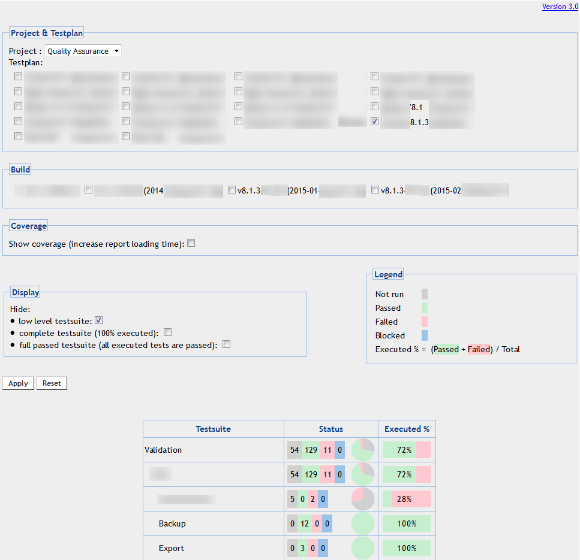

# SR-Testlink

Simple report for [Testlink](http://www.testlink.org).

I am not a developer, I don't understand the "_Testlink_" source code. However,
I need multi builds/testplans report view, So... All comments are in french
right now, I will try to change that later.

I just create one view. I do not modify the database content. However, as I say
before, I am not an expert, the SQL request can have an impact on performance.

Currently, the report page doesn't require login, it is a read only view (see
"_Force the user login_" section to modify this).

**NO WARRANTY**

THE PROGRAM IS DISTRIBUTED IN THE HOPE THAT IT WILL BE USEFUL, BUT WITHOUT ANY
WARRANTY. IT IS PROVIDED "AS IS" WITHOUT WARRANTY OF ANY KIND, EITHER EXPRESSED
OR IMPLIED, INCLUDING, BUT NOT LIMITED TO, THE IMPLIED WARRANTIES OF
MERCHANTABILITY AND FITNESS FOR A PARTICULAR PURPOSE. THE ENTIRE RISK AS TO THE
QUALITY AND PERFORMANCE OF THE PROGRAM IS WITH YOU. SHOULD THE PROGRAM PROVE
DEFECTIVE, YOU ASSUME THE COST OF ALL NECESSARY SERVICING, REPAIR OR CORRECTION.

IN NO EVENT UNLESS REQUIRED BY APPLICABLE LAW THE AUTHOR WILL BE LIABLE TO YOU
FOR DAMAGES, INCLUDING ANY GENERAL, SPECIAL, INCIDENTAL OR CONSEQUENTIAL DAMAGES
ARISING OUT OF THE USE OR INABILITY TO USE THE PROGRAM (INCLUDING BUT NOT
LIMITED TO LOSS OF DATA OR DATA BEING RENDERED INACCURATE OR LOSSES SUSTAINED BY
YOU OR THIRD PARTIES OR A FAILURE OF THE PROGRAM TO OPERATE WITH ANY OTHER
PROGRAMS), EVEN IF THE AUTHOR HAS BEEN ADVISED OF THE POSSIBILITY OF SUCH
DAMAGES.


### Installation

Just copy all files in "_Testlink_" root directory.

A SQL view must be created in the database. Simply add "admin" as **URL**
parameter to create it.

``http://<hostname>/sr_testlink.php?admin=1``

You could see errors because I try to delete the view before create it.

Change the **URL** to ``http://<hostname>/sr_testlink.php``, you are ready to
go.


### Screenshot




### Force the user login

If you want a login page, replace this section in ``sr_testlink.php``

Origin:
```
setPaths();
list($args,$gui) = initEnv();
doDBConnect($db,database::ONERROREXIT);
$user = new tlUser();
$user->dbID = $_SESSION['currentUser']->dbID;
$user->readFromDB($db);
$dbSecurityCookie = $user->getSecurityCookie();
// ====== fin du code testlink ======
```

By:

```
setPaths();
list($args,$gui) = initEnv();
$redir2login = true;
if( isset($_SESSION['currentUser']) ) {
	$securityCookie = tlUser::auth_get_current_user_cookie();
	$redir2login = is_null($securityCookie);
	if(!$redir2login) {
		doDBConnect($db,database::ONERROREXIT);
		$user = new tlUser();
		$user->dbID = $_SESSION['currentUser']->dbID;
		$user->readFromDB($db);
		$dbSecurityCookie = $user->getSecurityCookie();
		$redir2login = ( $securityCookie != $dbSecurityCookie );
	} 
}
if($redir2login) {
	unset($_SESSION['currentUser']);
	redirect(TL_BASE_HREF ."login.php");
	exit;
}
// ====== fin du code testlink ======
```


### Dependences

**Chart.js**

I use the open source Javascript library "_Chart.js_". More details on
[http://www.chartjs.org](http://www.chartjs.org). I just rename it to
``sr_chart.js``.


### License

"_SR-Testlink_" is available under the [Apache license version
2.0](http://www.apache.org/licenses/LICENSE-2.0.txt)

**Third-party**

"_Chart.js_" is available under the [MIT
license](http://opensource.org/licenses/MIT).


